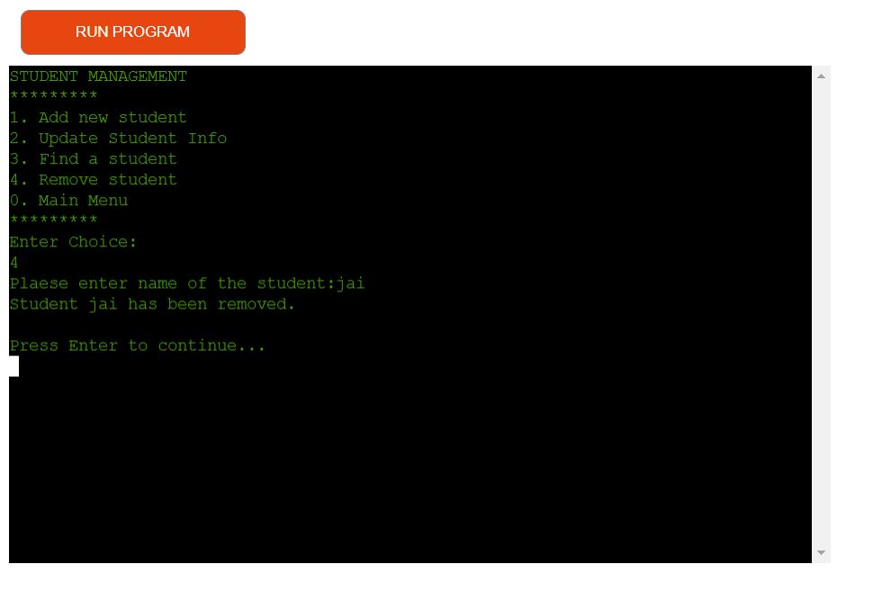
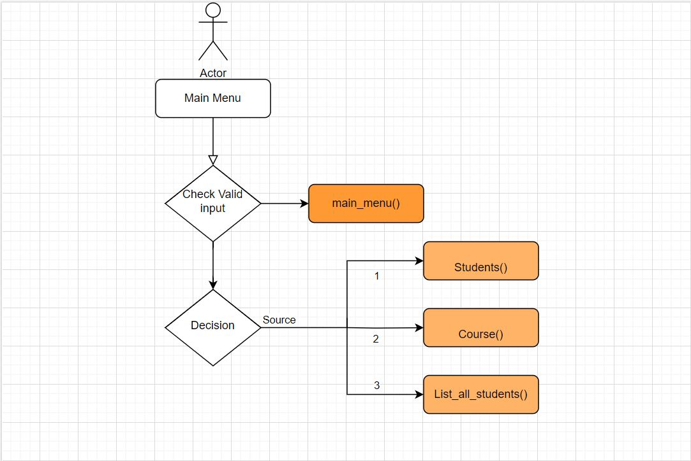
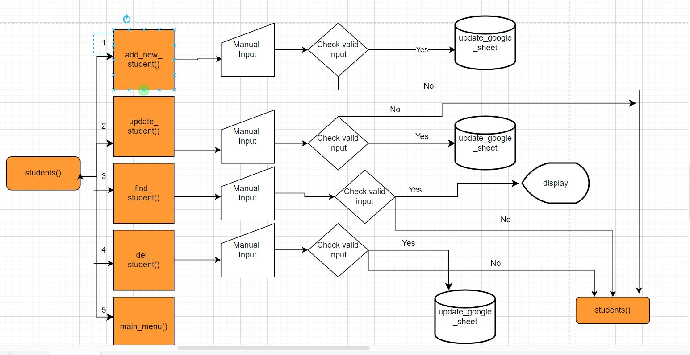
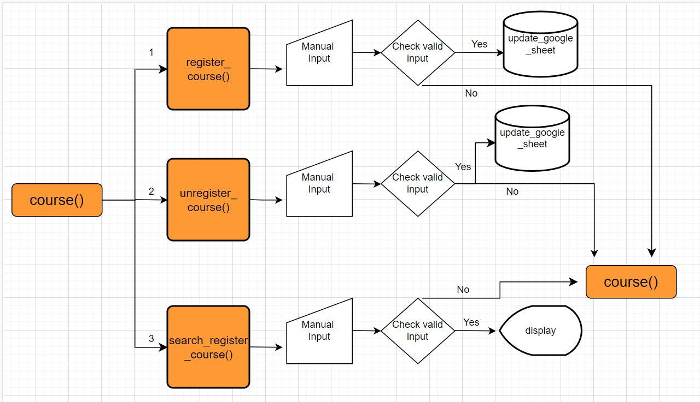
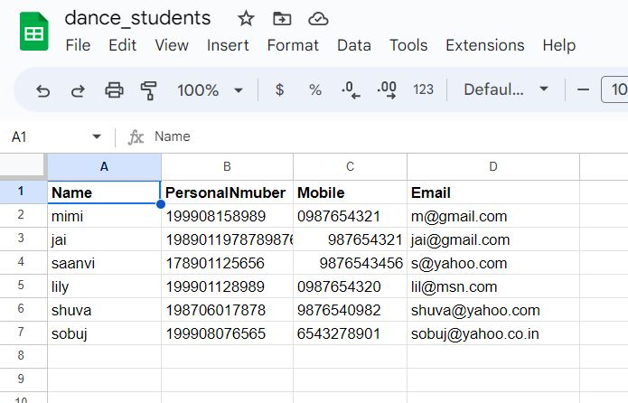
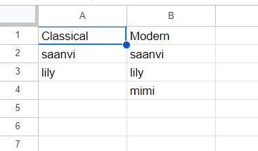
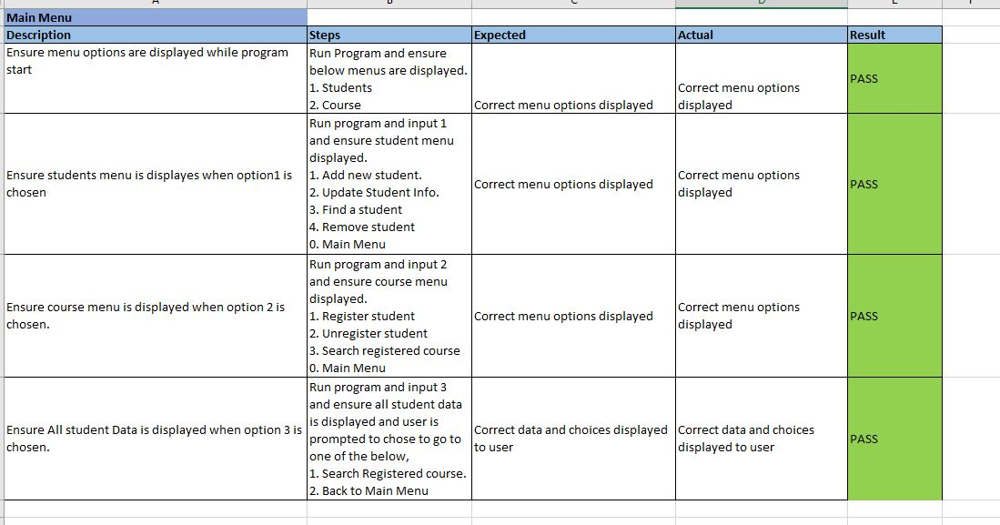
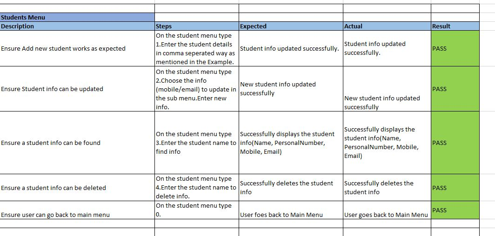
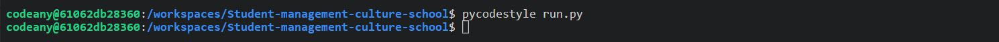

## Introduction
This project was created to manage the students of dance lessions in Älmhult Culture School.Schools can easily use the program to manage the information and registration of their students. It  allows school administrators to keep track of their students ánd courses information.

## Site Goals
Provide a simple application to allow the site owner to keep track of students and course registration.
Target Audience
Small school administrators,teachers who want to keep track of students info and course details.

## User Stories
 - As a User, I would like to be able to easily find the various menus so that I can view information or add / edit records.
 - As a User. I would like to be able to list and find my students and their registered course so I can manage their registrations.
 - As a User, I would like to be able to manage my students so that I can easily keep track of their contact info and edit / remove as neccessary.
 - As a User, I would like to be able to manage course registration for students so that I can register/unregister courses with ease.
 - As a User, I would like to be able to view student registration status so I can decide add/remove them accordingly.
 - As a User, I would like to be able to return to the main menu without having to restart the application.
## Features Planned
 - Simple, easy to use application with clear navigation.
 - Simple database storage for:
 - Create, read, update and delete functionality for students.
 - Create, read and delete functionality for course registration.
 - Ability to view student info and course registration.
 - Return to main menu option through sub menus.
 - Structure
 - Features

## USER STORY

As a User, I would like to be able to easily find the various menus so that I can view information or add / edit records.

IMPLEMENTATION

## Main Menu

When the application starts, a main menu will appear with the following options:
 - 1 - Students Menu
 - 2 - Course Menu
 - 3 - List All students

The user must input a correct number corresponding to each menu or they will be alerted of an inccorect choice and the menu will be presented again.
This feature will allow the user to easily access the sub menus to each category in order to perform the operations needed.
Main Menu

## USER STORY

As a User. I would like to be able to list and find my students and their registered course so I can manage their registrations.

IMPLEMENTATION

When the user choose option 3 in Menu. It displays all list of students. Then the user gets option either search course or go back to main menu.

## USER STORY

As a User, I would like to be able to manage my students so that I can easily keep track of their contact info and edit / remove as neccessary.

IMPLEMENTATION

### Students Menu:

When the user selects option 1 Students Menu from the main menu, the following menu options will appear:

The user must input a correct number corresponding to each menu or they will be alerted of an inccorect choice and the menu will be presented again.
This feature will allow the user to easily access the sub menus to each category in order to perform the operations needed.
Main Menu

### This feature will allow the user to easily add student.

### This feature will allow the user to easily update student info (Email/Mobile No.):

### This feature will allow the user to find student info based on student name input.

### This feature will allow the user to remove a student only if the student is not registered in a course.

## USER STORY

As a User, I would like to be able to manage course registration for students so that I can register/unregister courses with ease.

IMPLEMENTATION

Course Menu:

When the user selects option 2, Course Menu from the main menu, the following menu options will appear:

This feature will allow the user to register the student to classical/Modern or Both the courses.

This feature will allow the user to unregister the student to classical/Modern or Both the courses.

## USER STORY

As a User, I would like to be able to return to the main menu without having to restart the application.

IMPREMENTATION

All sub menus will have an option to return to the main menu, this will typically be 0.
This will allow the user to return to the main menu if they selected the wrong option or are finished with the particular menu.
This can be seen on all the menu screenshots above.

Error Handling

Error handling was implemented throughout the application with the use of try/except statements to handle exceptions raised for things like, None type values, Value errors. For all types of data input errors user will be alerted with a message and given a option to go back to the corresponding menu.

## Logical Flow

### Main Menu

### Students Menu

### Course Menu

# Google Sheet Design

- A google spreadsheet is created for this project https://docs.google.com/spreadsheets/d/1TndCTKtANLMzGCNryyoSZhjWc2OnZcVNVcEjNAU9mUU/edit#gid=0
- This spreadsheet has two worksheetes named 'student' and 'course'

Technologies
- Python - Python was the main language used to build the application.
- Python packages used:
   - Gspread - This was used as data storage in order to store the bike and booking information.
   - pandas - This was used to convert the worksheet data into a dataframe and then work on it.
   - colorama - The was used to control the font colors for the program.

# Testing
## Functional Testing
Below are the test execution of positive functional tests:

### Main menu functional testing

### Student menu functional testing

### Course menu functional testing

### Below are the test execution of negative functional tests:

Negative input validation testing was performed on all menu options to ensure correct input. All options behaved as expected, alerting the user of invalid input and then asking for input again.

## Pep8 Validation
All python code was ran through pycodestyle validation and any warnings or errors were fixed. Code then validated successfully.

In CodeAnywhere, warning was displayed by linter that env was imported but unused. This was being used by my env.py file during local development as it contained my database configuration variables so it was in fact used and the warning was ignored.

## Bugs and Fixes
Student name was being added at the end of the course column. Leaving the one corresponding blank cell if student is already registered to another course before.A fix was implemented to find the correct cell and update value to update the course registration for a student.

A validation was added to check for registered course before user can remove a student from student sheet.User will be alerted to unregister the course first.

Validation was implemented to ensure correct date format was input as this was causing errors when an invalid format was used.

## Deployment

The following git commands were used throughout development to push code to the remote repo:

git add <file> - This command was used to add the file(s) to the staging area before they are committed.

git commit -m "commit message" - This command was used to commit changes to the local repository queue ready for the final step.

git push - This command was used to push all committed code to the remote repository on github.

## Heroku Deployment
The below steps were followed to deploy this project to Heroku:

- Go to Heroku and click "New" to create a new app.
- Choose an app name and region region, click "Create app".
- Go to "Settings" and navigate to Config Vars. Add the following config variables: Add CREDS Variable.
- Scroll down to Manual Deploy, select "main" branch and click "Deploy Branch".
- The app will now be deployed to heroku here
[Student-Management-Culture-School](https://student-management.herokuapp.com/)

### Clone Locally
Open IDE of choice and type the following into the terminal:

Project will now be cloned locally.
Note: If you want to use the application, follow the steps in the MongoDB Setup first then create an env.py file with the following variable:

Credits

Gspread documentation - Followed the gspread documentation to understand gspread usage for different activities throughout the project.

[Gspread doc](https://docs.gspread.org/en/latest/)

Example from the below link followed to validate the email with python.

[validate email](https://www.geeksforgeeks.org/check-if-email-address-valid-or-not-in-python/)

All the guidance and input from my mentor Gareth Mcgirr were followed throughout the project.

W3C tutorials were used as a reference for python functions like pandas,colorama,os and  and  throughout this project.